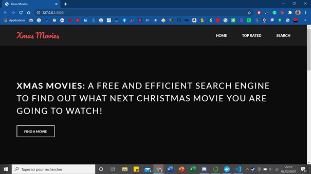
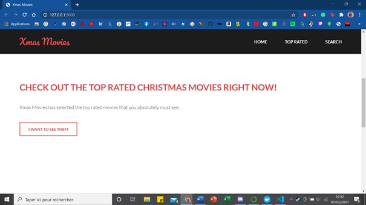
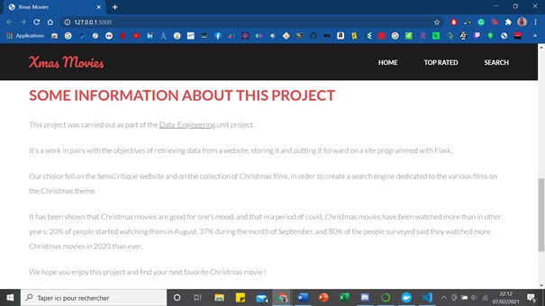
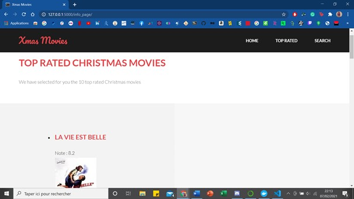
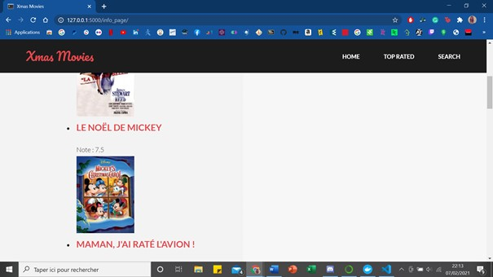
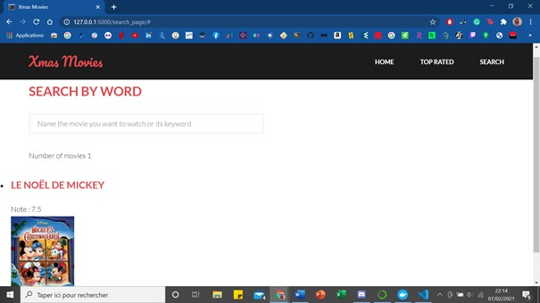

**Data Engineering project**

This project is composed of the following tools : Flask, web scrapping with Scrapy, ElasticSearch and Docker.

**Chrismas Movies project**

This project is a web site which allows the users to discover new christmas movies.

**RUN**

To run this project, you have to launch Docker and enter 
`docker-compose up -d --build`

After, you run the python script chrismasMovies.py, that should give you the link to the app : http://127.0.0.1:5000/

The home page is just the menu to the others pages and somes informations about the project.

**SEARCH**

The second page "Top rated" show the top 10 of the movies and the last page allows the user to search a movie with their words. 

**COPYRIGHT**

For the website we use a CSS and HTML templaate from https://templated.co/
